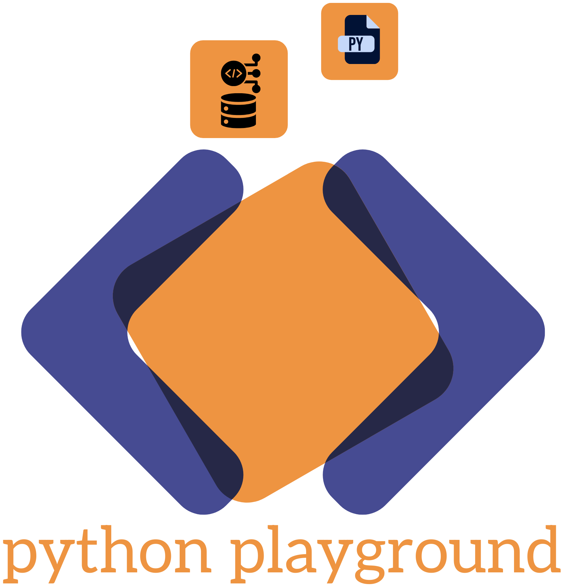

<p>
  
    
</p>

Official website for **DjangoPlay**

### 🌐 Production
https://djangoplay.org/

---

## Overview

This website serves multiple purposes:

* DjangoPlay platform Home page
* Developer portfolio
* Open-source libraries showcase
* Architecture and engineering philosophy presentation
* Central hub linking GitLab, GitHub, PyPI, and relevant projects
* Platform roadmap and future features

The site is built as a **fully static website** using HTML, CSS, and vanilla JavaScript — no frontend frameworks required.

---

## Features

### Home Page
* Project introduction
* Technology stack overview
* Architecture principles
* Animated code block
* Responsive layout

### Developer Portfolio
* Developer profile
* Career timeline
* Featured project (DjangoPlay)
* Open-source libraries (PyPI)
* Repository list
* Skills grid
* Social links
* Section scroll navigation
* Roadmap modal ("What's Next")

### Navigation & UI
* Header dropdown menu (Docs / Issues)
* Responsive modal system
* Lazy-loaded roadmap modal
* Tooltip-enabled header icons
* Version badge
* Theme toggle

### Theme System
* Light theme
* Space / dark theme
* Animated star background
* Theme toggle with persistence

### Portfolio Content System
Portfolio content is rendered dynamically from a JSON file, allowing content updates without modifying HTML or JavaScript.

### Roadmap System
The Developer page includes a "What's Next?" roadmap modal which shows upcoming platform features and development plans.

Roadmap system features:
* Lazy-loaded roadmap content
* Packaged JSON roadmap data
* Responsive modal (desktop modal + mobile bottom sheet)
* Feedback contact section
* Header roadmap icon with active state

### Dynamic Environment Configuration
The website supports dynamic environment configuration so the same build can run on localhost, staging, or production without modifying source code.

Configuration is read from:

```

~/.dplay/config.yaml

```

This generates:

```

assets/json/site_config.json

```

The site loads this file at runtime and dynamically updates links such as:
* Docs
* Issues
* Platform Console

This allows subdomain routing such as:

- [https://docs.djangoplay.org](https://docs.djangoplay.org)

- [https://issues.djangoplay.org](https://issues.djangoplay.org)

and also supports local development environments (if configured subdomains locally) like:

- [http://docs.localhost:3000](http://docs.localhost:3000)

- [http://issues.localhost:3000](http://issues.localhost:3000)

---

## Performance Features
* Lazy image loading
* Lazy-loaded roadmap data
* Scroll spy navigation
* Minimal JavaScript
* No external frameworks
* Packaged JSON content
* Fast load times

---

## Project Structure

```

djangoplay-site/
│
├── index.html
├── developer.html
│
├── assets/
│   ├── css/
│   ├── js/
│   ├── json/
│   ├── images/
│
├── dist/
│   ├── css/
│   ├── js/
│   ├── json/
│   └── brand/
│
└── README.md

```

---

## JSON Packaging System

To improve performance and reduce multiple HTTP requests, JSON content files are packaged and loaded from `/dist/json`.

Example packages:
* content.pkg → Portfolio content
* roadmap.pkg → Platform roadmap
* search-index.json → Search system

This allows:
* Faster page load
* Lazy loading of non-critical content
* Smaller number of requests

---

## Design Architecture

The CSS architecture follows a structured design system:

| File            | Purpose                                       |
| --------------- | --------------------------------------------- |
| tokens.css      | Design tokens (colors, spacing, typography)   |
| base.css        | Layout, navigation, footer, shared components |
| index.css       | Home page styles                              |
| developer.css   | Developer portfolio styles                    |
| space-theme.css | Space theme visual effects                    |

This separation ensures maintainability and scalability.

---

## JavaScript Modules

| File            | Purpose                                              |
| --------------- | ---------------------------------------------------- |
| main.js         | Page initialization, nav active state, lazy images   |
| theme.js        | Theme toggle and persistence                         |
| space.js        | Star background animation                            |
| portfolio.js    | Renders developer portfolio from JSON                |
| site_config.js  | Dynamic environment link resolver                    |
| roadmap.js      | Roadmap modal and lazy-loaded roadmap content        |
| code-block.js   | Animated code block on Home page                     |

---

## Running the Website

Since this is a static website, you can run it using any static server.

### Option 1 — Python
```

python -m http.server 8000

```

### Option 2 — Node
```

npx serve

```

### Option 3 — Open directly
Open `index.html` in the browser.

---

## Deployment

This site can be deployed to:

* GitHub Pages
* GitLab Pages
* Netlify
* Vercel
* Any static hosting service

CI pipeline handles:
* Config injection
* Asset packaging
* Deployment sync

---

## Architecture Notes

The website follows a lightweight static architecture with dynamic content loading.

Key architectural decisions:
* No frontend frameworks (pure HTML, CSS, JS)
* Design token based CSS system
* JSON-driven content rendering
* Runtime environment configuration
* Lazy-loaded non-critical content
* Packaged JSON data for production
* Modular JavaScript structure
* Responsive modal and dropdown components

This approach keeps the site fast, portable, and easy to maintain.

---

## Repositories

* 🦊 GitLab: https://gitlab.com/codefleet
* 🐙 GitHub Mirror: https://github.com/codefleetx

---

## License

This project is released under the MIT License.

---

## Author

**Chandrashekhar Bhosale**  
Software Engineer | Python, Django Backend | Systems Architecture  
Contact: contact@djangoplay.org